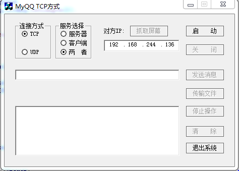

ui：
VC++仿QQ聊天、屏幕截图、文件发送等功能
VC++仿QQ聊天、屏幕截图、文件发送等功能，这个源码相当实用吧，包括的截图、网络传输等功能都相当实用的，涉及到网络编程、图形处理等相关知识。聊天程序部分是基于TCP和UDP来共同实现。

相关标签：聊天 UDP 截图 文件传输 抓图
调试环境：Visual C++ 6.0
文件大小：26.8K
资源评级：
更新时间：2014-10-01
相关链接：暂无演示

